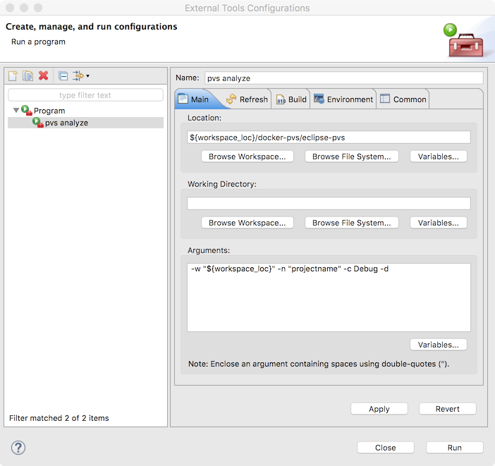

### PVS-Studio for macOS via docker
___


### Install

Make sure you have installed:

 [Docker](https://docs.docker.com/docker-for-mac/)
 
 [Eclipse CDT](https://eclipse.org/cdt/)
 
 [GNU ARM Eclipse](https://gnuarmeclipse.github.io)
 
 [GNU ARM Embedded Toolchain](https://launchpad.net/gcc-arm-embedded) - [how to install](http://gnuarmeclipse.github.io/toolchain/install/#macos) *- recommended gcc version is 5.4.1 20160919 (release)*
 
 Make sure, what your Eclipse workspace directory is present in Docker file sharing path *- if directory is located in user home directory, you may go to next step*
 


Clone [docker-pvs](https://github.com/timurey/docker-pvs) in your Eclipse workspace directory  

```
$ git clone https://github.com/timurey/docker-pvs.git
$ cd docker-pvs
$ ./run_once.sh
```
### Well done!
You can use it in command line.

```
$ ./eclipse-pvs [[-w <path> -n <name> -c <descriptor> [-d]]| -h]
```
where args:

	-w(--workspace)   <path>      full path to workspace directory
	-n(--projectname) <name>    project name in eclipse
	-c(--config)      <config>  config descriptor (Debug or Release)
	-d(--debug)                 show some debug info
	-h(--help)                  show help


```
docker-pvs image contains:
	GNU Make 3.81 (ubuntu repository)
	gcc-arm-embedded version 5.4.1 20160919 (team-gcc-arm-embedded/ppa repository)
	PSV-Studio 6.11.20138.1 (http://www.viva64.com/en/pvs-studio-download-linux/)

```

### Update
```
$ ./run_once.sh
```
### Your own changes
You may want to change version of PVS-Studio, or gcc.

You can change `Dockerfile` in `docker-pvs` or `docker-psv-base` directory. Then run `./build.sh`, which located near `Dockerfile`
 
### Setup Eclipse
#### Work as external tool
In Eclipse do:

`Run->External Tools->External Tools configuration...`

Then, press button `New launch configuration`,
In `Location` field paste `${workspace_loc}/docker-pvs/eclipse-pvs`

In `Arguments` field type `-w "${workspace_loc}" -n "projectname" -c Debug`

`"projectname"` - project name (in double quotes)

`Debug` - Build configuration (Debug or Release)




At `Common` tab you need to check box `Allocate console`


`Apply` and `Run`!

####Work as compiler
Right-click on project in `Project explorer` (or `⌘+I`).
Choose `C/C++ Build` on left panel and press button `Manage configurations...`


Press `New` button and type name of new configuration `PVS-Studio`


Press `OK` and `OK`

Now change `Configuration` to `PVS-Studio`, uncheck `Use default build command` and paste to `Build command` this command: `${workspace_loc}/docker-pvs/eclipse-pvs -w "${workspace_loc}" -n ${ProjName} -c Debug -d`


Press `OK`

In menu press `Project->Build Configuration->Set Active->PVS-Studio`


Press `⌘+B`


###Licensing PVS-Studio
####If you have license file for PVS-Studio
Copy put in near `pvs-studio.cfg`

Add string `lic-file = /root/workspace/filename`
####If you don't have license file for PVS-Studio
Read [article](http://www.viva64.com/en/b/0457/) from viva64.com, how to use PVS-Studio for free.
### Contributors

 Author: [timurey](https://github.com/timurey)

### License

  MIT
